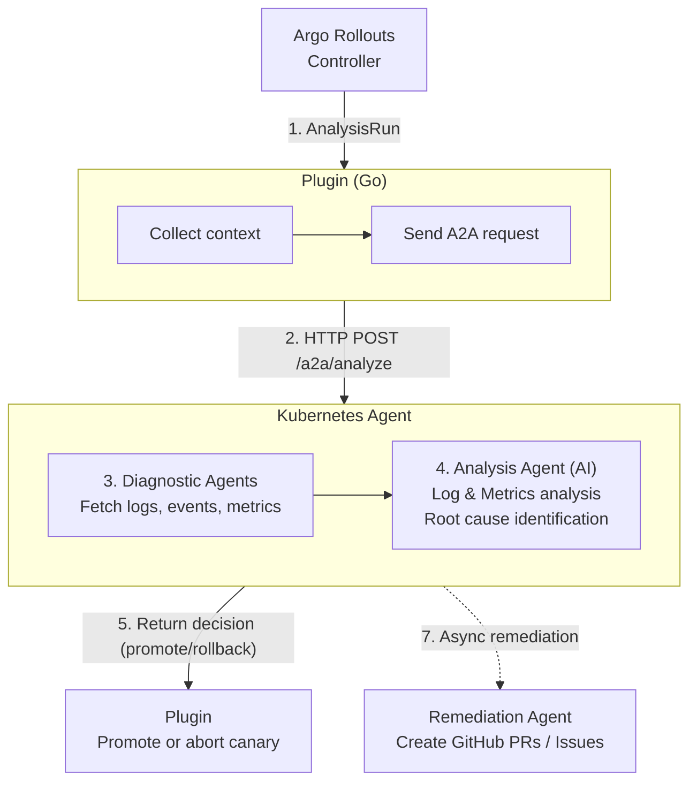

## rollouts-plugin-metric-ai

Argo Rollouts metric provider plugin written in Go. Collects stable/canary pod logs and delegates AI analysis to an A2A agent. The agent fetches logs autonomously and can create GitHub issues/PRs when configured.

## Quick Links

- **Kubernetes Agent**: [kdubois/kubernetes-aiops-agent](https://github.com/kdubois/kubernetes-aiops-agent)
- **Demo Application**: [argo-rollouts-quarkus-demo](https://github.com/kdubois/argo-rollouts-quarkus-demo)

## Overview

This plugin bridges Argo Rollouts with an autonomous Kubernetes Agent for AI-powered canary analysis. Instead of making direct LLM calls, it sends analysis requests to an agent that debugs pods, analyzes logs and metrics, identifies root causes, and creates GitHub PRs with fixes.

## Installation

### Option 1: RolloutManager (Recommended)

If using the Argo Rollouts Operator with RolloutManager:

```yaml
apiVersion: argoproj.io/v1alpha1
kind: RolloutManager
metadata:
  name: argo-rollouts
spec:
  plugins:
    metric:
      - name: argoproj-labs/metric-ai
        location: https://github.com/argoproj-labs/rollouts-plugin-metric-ai/releases/download/v1.9.0/rollouts-plugin-metric-ai-linux-amd64
```

Replace `v1.9.0` with the desired release version. See [releases](https://github.com/argoproj-labs/rollouts-plugin-metric-ai/releases) for available versions.

### Option 2: ConfigMap

For manual installation without RolloutManager:

```yaml
apiVersion: v1
kind: ConfigMap
metadata:
  name: argo-rollouts-config
data:
  metricProviderPlugins: |-
    - name: "argoproj-labs/metric-ai"
      location: "file://./rollouts-plugin-metric-ai/bin/metric-ai"
```

## Configuration

### AnalysisTemplate Example

```yaml
apiVersion: argoproj.io/v1alpha1
kind: AnalysisTemplate
metadata:
  name: canary-analysis
spec:
  metrics:
    - name: ai-analysis
      provider:
        plugin:
          argoproj-labs/metric-ai:
            agentUrl: http://kubernetes-agent.argo-rollouts.svc.cluster.local:8080
            stableLabel: role=stable
            canaryLabel: role=canary
            # Optional: Additional context for AI analysis
            extraPrompt: "Focus on error patterns and performance metrics"
```

## How It Works

The plugin uses the A2A protocol to delegate analysis to the Kubernetes Agent:

1. Plugin collects pod labels and namespace information
2. Sends A2A request to the agent
3. Agent fetches logs and metrics
4. Agent analyzes with AI
5. Agent identifies root causes
6. Agent returns structured JSON response with promote/rollback decision
7. Plugin uses result to promote or abort canary
8. Agent asynchronously creates GitHub PRs with fixes (if needed)

No LLM configuration needed in the plugin. The agent handles its own model configuration, log fetching, and GitHub integration. Remediation happens asynchronously after the rollout decision is made.

### Architecture



## Prerequisites

Deploy the Kubernetes Agent in your cluster. See [kdubois/kubernetes-aiops-agent](https://github.com/kdubois/kubernetes-aiops-agent) for an example that runs analysis with logs and metrics
and root cause identification.
The agent must be accessible via HTTP from the Argo Rollouts controller.

Analysis fails if:
- `agentUrl` is not configured
- Agent is unavailable or health check fails
- A2A communication fails

No fallback mode exists.

## Configuration Fields

### Plugin Configuration

| Field | Type | Required | Description |
|-------|------|----------|-------------|
| `agentUrl` | string | **Yes** | A2A agent URL (e.g., `http://kubernetes-agent:8080`) |
| `stableLabel` | string | Yes | Label selector for stable pods (e.g., `role=stable`) |
| `canaryLabel` | string | Yes | Label selector for canary pods (e.g., `role=canary`) |
| `githubUrl` | string | No | GitHub repository URL for issue creation |
| `baseBranch` | string | No | Git base branch for issue creation |
| `extraPrompt` | string | No | Additional context for AI analysis |

Namespace is auto-detected from AnalysisRun.

### Environment Variables

| Variable | Required | Description |
|----------|----------|-------------|
| `LOG_LEVEL` | No | Log level: `panic`, `fatal`, `error`, `warn`, `info`, `debug`, `trace` (default: `info`) |

The plugin doesn't need API keys. The model configuration happens in the agent setup itself.

## Extra Prompt Feature

Pass additional context to the AI via `extraPrompt`:

```yaml
extraPrompt: "High-traffic e-commerce service. Focus on error rates, response times, and database connections. Consider business impact."
```

Use cases:
- Performance focus: "Focus on response times and throughput"
- Error analysis: "Pay attention to error rates and exceptions"
- Business context: "Critical payment service - prioritize stability"
- Technical constraints: "Consider memory usage and connection limits"
- Ignore expected changes: "Ignore color changes in output"

## Building

```bash
# Build Go binary
make build

# Build Docker image
make docker-build

# Build multi-platform and push
make docker-buildx
```

## CI/CD

GitHub Actions builds and publishes multi-platform images to `ghcr.io/argoproj-labs/rollouts-plugin-metric-ai:<commit-sha>` on pushes to main.

## Examples

See `examples/` for analysis templates and ConfigMap setup.

See `config/rollouts-examples/` for complete deployments with rollouts, services, and traffic generators.

Complete working examples:
- [argo-rollouts-quarkus-demo](https://github.com/kdubois/argo-rollouts-quarkus-demo) - Demo app with test scenarios
- [progressive-delivery](https://github.com/kdubois/progressive-delivery) - Full GitOps setup

## Debugging and Logging

Control log level with `LOG_LEVEL` environment variable.

Levels: `panic`, `fatal`, `error`, `warn`, `info` (default), `debug`, `trace`

### Setting Log Level

Environment variable:
```bash
export LOG_LEVEL=debug
```

Kubernetes deployment:
```yaml
apiVersion: apps/v1
kind: Deployment
metadata:
  name: argo-rollouts
spec:
  template:
    spec:
      containers:
      - name: argo-rollouts
        env:
        - name: LOG_LEVEL
          value: "debug"
```

Kustomize: Already configured in `config/argo-rollouts/kustomization.yaml`

### Viewing Logs

```bash
# All logs
kubectl logs -f -n argo-rollouts deployment/argo-rollouts

# Plugin-specific
kubectl logs -n argo-rollouts deployment/argo-rollouts | grep -E "metric-ai|AI metric|plugin"

# With timestamps
kubectl logs -n argo-rollouts deployment/argo-rollouts --timestamps=true
```

Debug/trace levels log:
- Configuration parsing
- Pod log operations
- A2A communication
- Agent health checks
- GitHub interactions
- Performance metrics

## Troubleshooting

### Agent Connection Issues

When using the example agents

Check agent URL:
```bash
kubectl get analysistemplate -n <namespace> <template-name> -o yaml | grep agentUrl
```

Verify agent is running:
```bash
kubectl get pods -n argo-rollouts | grep kubernetes-agent
kubectl logs -n argo-rollouts deployment/kubernetes-agent
```

Test agent health:
```bash
# From cluster
curl http://kubernetes-agent.argo-rollouts.svc.cluster.local:8080/q/health

# Port-forward
kubectl port-forward -n argo-rollouts svc/kubernetes-agent 8080:8080
curl http://localhost:8080/q/health
```

**Note**: The agent uses `/q/health` which is the standard Quarkus health endpoint. This provides comprehensive health checks including readiness and liveness probes.

Check plugin logs:
```bash
kubectl logs -n argo-rollouts deployment/argo-rollouts | grep -E "agent|A2A|Attempting to create"
```

### Common Issues

- "agentUrl is required": Add `agentUrl` to AnalysisTemplate
- "Agent health check failed": Verify agent is running and accessible
- "A2A agent analysis failed": Check agent logs and network
- GitHub issue creation skipped: Check for "githubUrl not configured" in logs
- Namespace auto-detection: Uses namespace from AnalysisRun automatically

For agent-specific issues, see [Kubernetes Agent Troubleshooting](https://github.com/kdubois/kubernetes-aiops-agent#troubleshooting).

## Testing

```bash
# Create Kind cluster and run e2e tests
make test

# Run e2e tests only
make test-e2e
```

## Related Projects

- [kubernetes-aiops-agent](https://github.com/kdubois/kubernetes-aiops-agent) - The AI agent
- [argo-rollouts](https://github.com/argoproj/argo-rollouts) - Progressive delivery controller
- [argo-rollouts-quarkus-demo](https://github.com/kdubois/argo-rollouts-quarkus-demo) - Demo application

## License

Apache License 2.0

## Contributing

Fork, create feature branch, add tests, submit PR.

## Support

- Plugin issues: [Create issue](https://github.com/argoproj-labs/rollouts-plugin-metric-ai/issues)
- Agent issues: [Create issue](https://github.com/kdubois/kubernetes-aiops-agent/issues)
- Documentation: [Agent docs](https://github.com/kdubois/kubernetes-aiops-agent)
